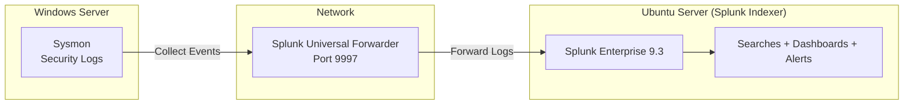

# Windows Event Monitoring & Threat Hunting Dashboard using Splunk

## Project Overview

This project demonstrates the deployment of Splunk Enterprise and Splunk Universal Forwarder for centralized Windows log monitoring. Windows Security Event Logs and Sysmon logs were collected from a Windows Server and forwarded to Splunk for security monitoring, log analysis, threat hunting, and dashboard creation.

The project focuses on monitoring authentication activity, privilege assignments, process execution events, and overall Windows security events using Search Processing Language (SPL).

---

## Environment Setup

### Components Used

* Splunk Enterprise 9.3
* Splunk Universal Forwarder
* Windows Server
* Ubuntu Server (Splunk Indexer)
* Sysmon
* VirtualBox

### Architecture

**Theory**

The architecture follows a centralized log collection model. Windows security events are generated by the operating system and Sysmon. The Splunk Universal Forwarder installed on the Windows Server collects these logs in real-time and forwards them over the network to the Splunk Enterprise indexer hosted on Ubuntu. Once indexed, the data becomes searchable and can be analyzed using SPL (Search Processing Language), dashboards, and alerts. This decoupled design ensures minimal performance impact on the monitored server while enabling scalable centralized monitoring.

For full architecture details, see [docs/01-lab-architecture.md](docs/01-lab-architecture.md).

---

## Important Windows Event IDs

| Event ID | Description |
| -------- | ----------- |
| 4624 | Successful Logon |
| 4625 | Failed Logon |
| 4672 | Special Privileges Assigned |
| 4673 | Privileged Service Call |
| 4674 | Privileged Object Operation |
| 4688 | Process Creation |
| 4768 | Kerberos TGT Request |
| 4769 | Kerberos Service Ticket |
| 4771 | Kerberos Pre-Auth Failure |
| 4907 | Auditing Settings Changed |
| 7036 | Service Started/Stopped |
| 7045 | Service Installation |

For a complete reference, see [docs/07-event-log-collection.md](docs/07-event-log-collection.md).

---

## Documentation Reference

| Document | Description |
|----------|-------------|
| [01 - Lab Architecture](docs/01-lab-architecture.md) | Infrastructure overview, data flow, component responsibilities |
| [02 - Splunk Overview](docs/02-splunk-overview.md) | Splunk Cloud vs Enterprise, license model |
| [03 - Splunk Components](docs/03-splunk-components.md) | Forwarders, Indexers, Search Heads |
| [04 - Forwarders](docs/04-forwarders.md) | Universal Forwarder vs Heavy Forwarder |
| [05 - Deployment Architecture](docs/05-deployment-architecture.md) | Single instance, distributed, clustered deployments |
| [06 - Implementation Guide](docs/06-implementation-guide.md) | Step-by-step setup (AD, DHCP, Splunk, forwarder) |
| [07 - Event Log Collection](docs/07-event-log-collection.md) | Event IDs, log types, inputs configuration |
| [08 - SPL Queries & Commands](docs/08-spl-queries.md) | All SPL commands, examples, screenshots, threat hunting queries |
| [09 - Dashboards](docs/09-dashboards.md) | Dashboard panels, threat hunting queries, best practices |
| [Screenshots Gallery](docs/screenshots.md) | Complete gallery of all 35 screenshots |

---

## Dashboard

The final dashboard includes:

* Total Events
* Successful Login Attempts
* Failed Login Attempts
* Privileged Logons
* Top Event IDs (Bar Chart)
* Authentication Activity (Line Chart)
* User Login Activity (Pie Chart)
* EventCode Distribution (Bubble Chart)
* Logon Trend Comparison (Area Chart)
* Most Active Process Paths
* User Authentication Flow (Sankey Diagram)

For detailed panel queries and setup, see [docs/09-dashboards.md](docs/09-dashboards.md).

---

## Skills Demonstrated

* Splunk Enterprise Administration
* Splunk Universal Forwarder Configuration
* Windows Event Log Analysis
* Sysmon Monitoring
* SPL Query Development
* Dashboard Creation
* Threat Hunting
* Authentication Monitoring
* Security Event Investigation
* SOC Analyst Workflows
