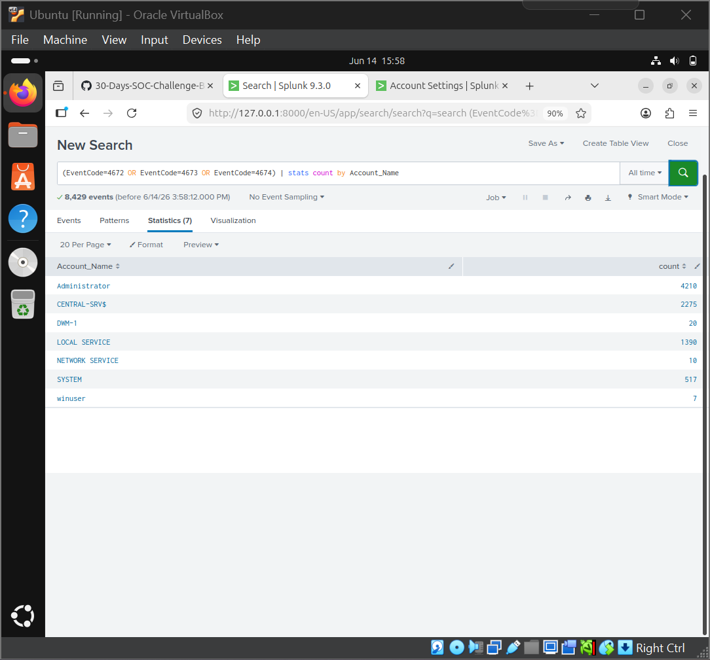
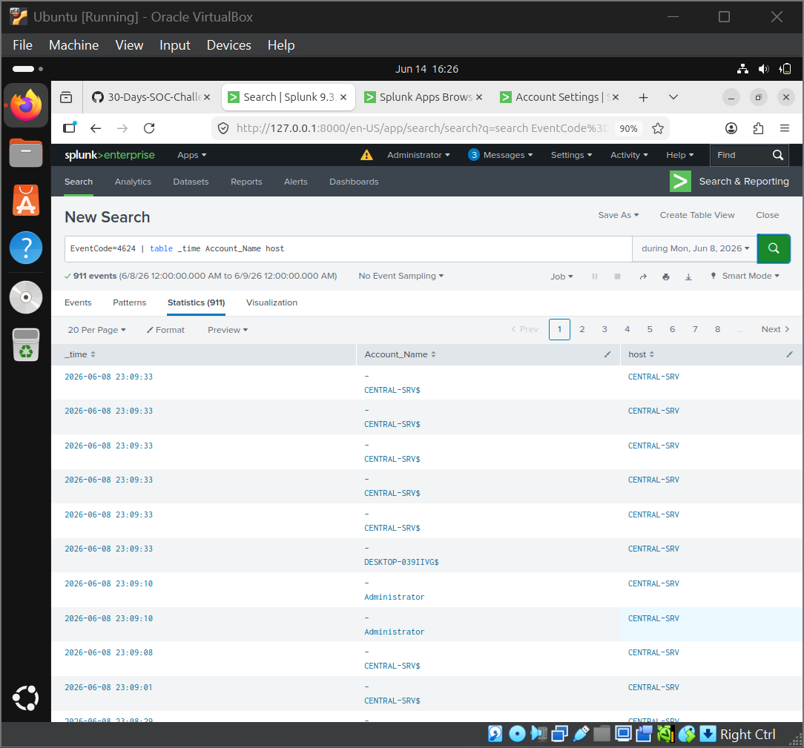
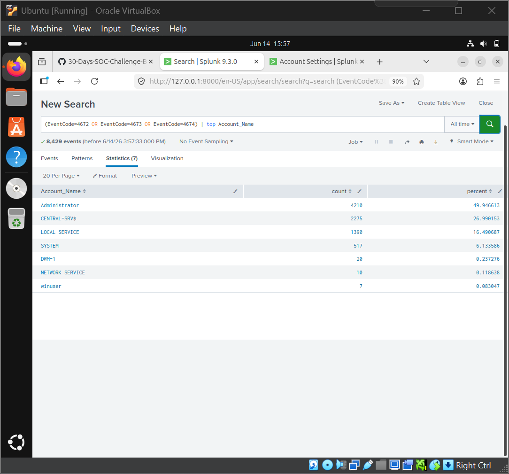
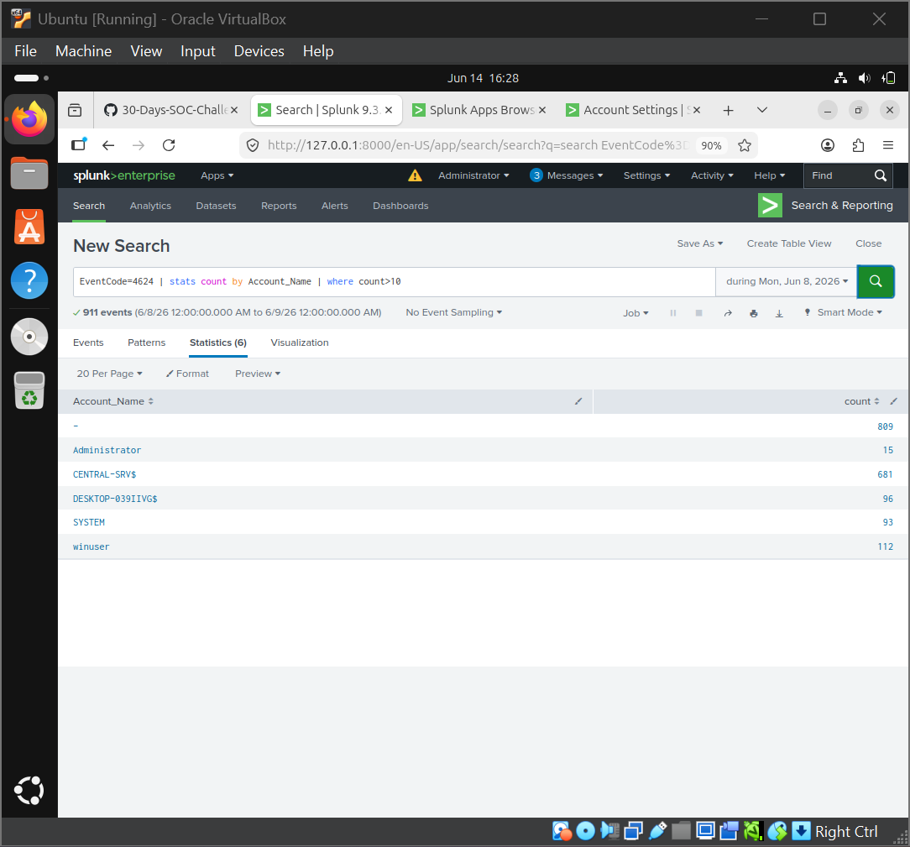
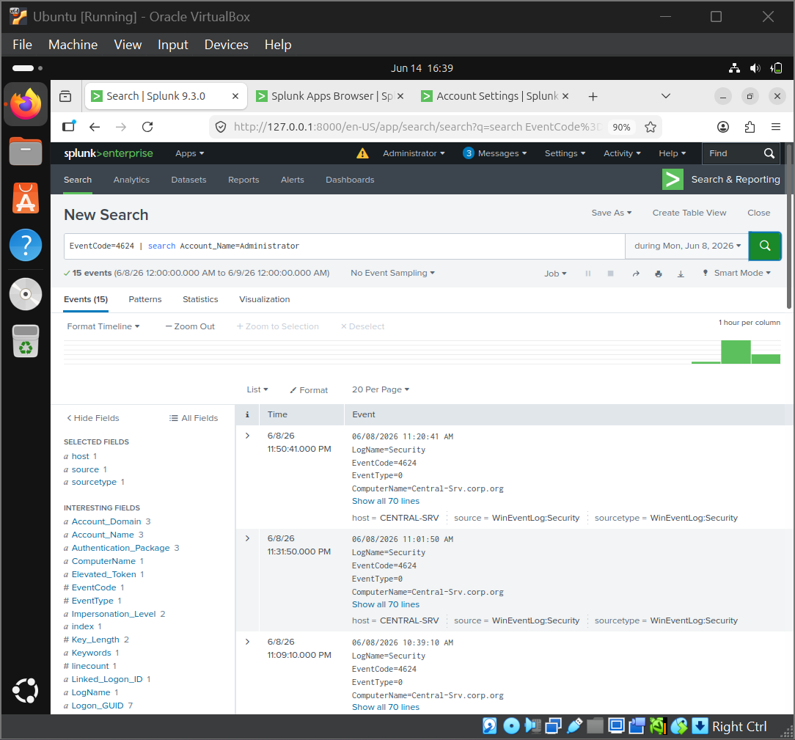
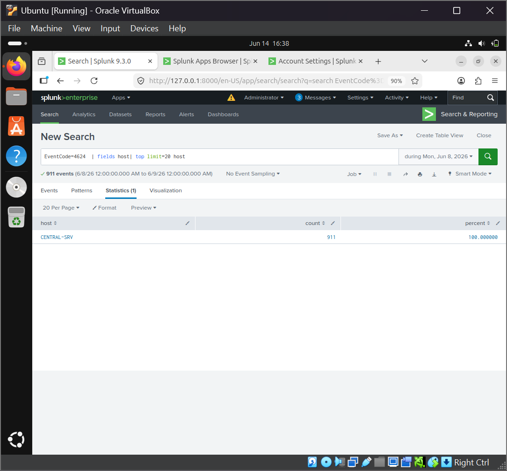
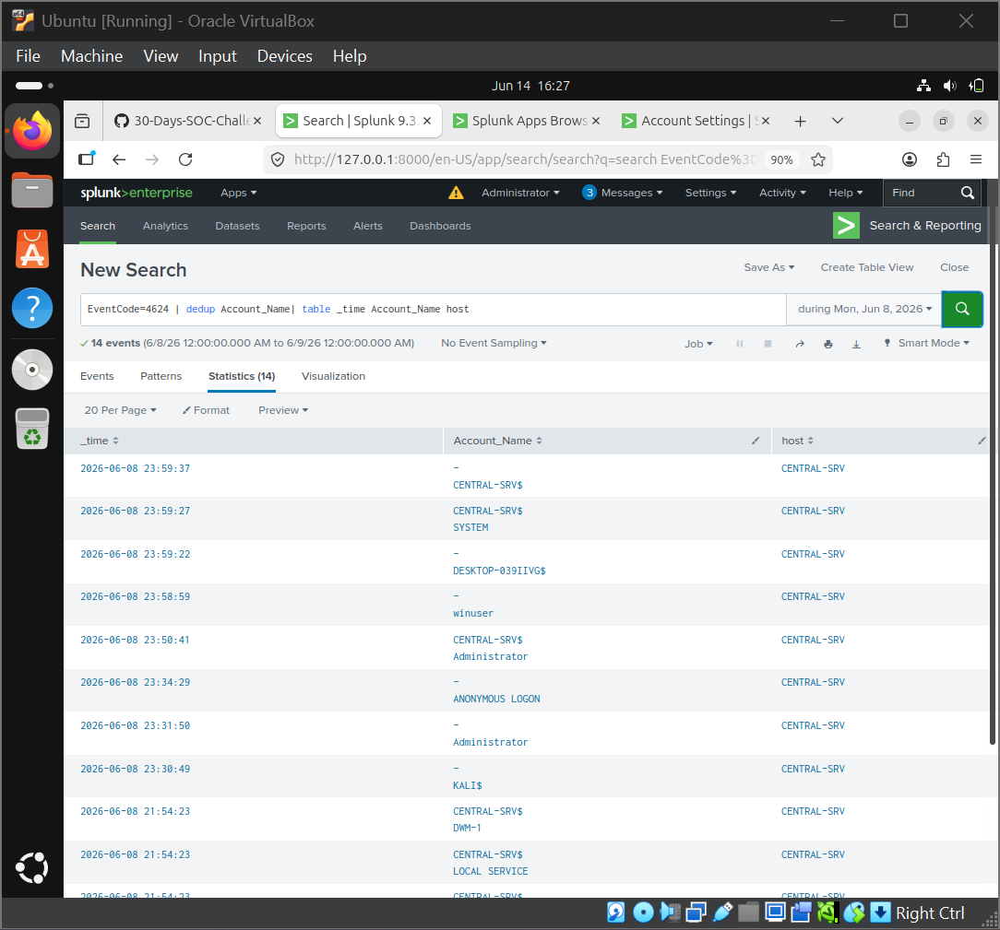
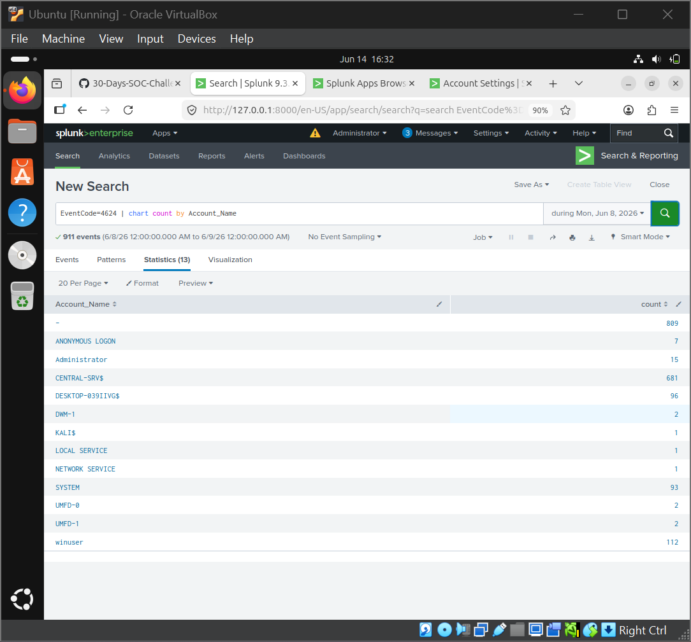
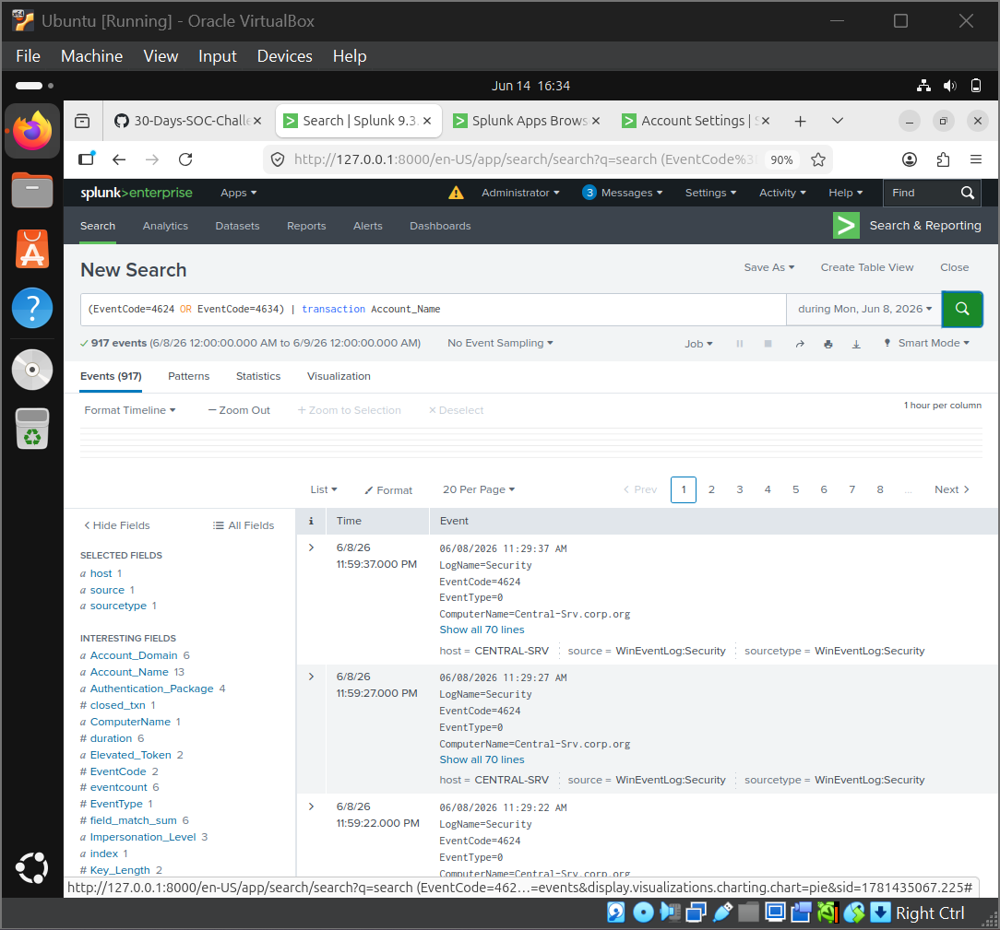

# SPL Query Reference

## SPL Commands Used

### 1. stats

**Theory** — The `stats` command aggregates and summarizes data using functions like `count`, `sum`, `avg`, `distinct_count`, etc.

**Example**
```spl
EventCode=4624 OR EventCode=4673 OR EventCode=4672
| stats count by Account_Name
```



---

### 2. table

**Theory** — The `table` command displays only the specified fields in a tabular format.

**Example**
```spl
EventCode=4624
| table _time Account_Name host
```



---

### 3. top

**Theory** — The `top` command shows the most frequent values of a field, sorted by count descending.

**Example**
```spl
(EventCode=4672 OR EventCode=4673 OR EventCode=4674)
| top Account_Name
```



---

### 4. where

**Theory** — The `where` command filters results after aggregation or eval, using boolean expressions.

**Example**
```spl
EventCode=4624
| stats count by Account_Name
| where count>10
```



---

### 5. eval

**Theory** — The `eval` command creates new calculated fields using expressions, conditionals, and string functions.

**Example**
```spl
EventCode=4624
| stats count by Account_Name
| eval Risk=if(count>100,"HIGH","LOW")
```


---

### 6. timechart

**Theory** — The `timechart` command creates time-based trend visualizations, automatically grouping events into time buckets.

**Example**
```spl
EventCode=7036 OR EventCode=7045
| timechart count by EventCode
```


---

### 7. search

**Theory** — The `search` command filters events by keywords or field-value pairs. It is implicit at the start of any SPL query.

**Example**
```spl
search Account_Name=Administrator
```



---

### 8. fields

**Theory** — The `fields` command retains or removes specified fields from search results.

**Example**
```spl
EventCode=4624
| fields host
| top limit=20 host
```



---

### 9. dedup

**Theory** — The `dedup` command removes duplicate events based on specified field values, keeping only the first occurrence.

**Example**
```spl
EventCode=4624 | dedup Account_Name
| table _time Account_Name host
```



---

### 10. chart

**Theory** — The `chart` command produces tabular aggregations suitable for visualizing as bar, column, or pie charts.

**Example**
```spl
EventCode=4624 | chart count by Account_Name
```



---

### 11. rex

**Theory** — The `rex` command extracts fields from event data using named regular expression groups.

**Example**
```spl
EventCode=4688
| rex field=CommandLine "(?<Executable>\w+\.exe)"
```


---

### 12. transaction

**Theory** — The `transaction` command groups related events into sessions based on common field values, with optional time limits.

**Example**
```spl
(EventCode=4624 OR EventCode=4634)
| transaction Account_Name
```



---

## Authentication Monitoring

```spl
# Successful logins
index=windows sourcetype=WinEventLog:Security EventCode=4624
| table _time, Account_Name, Source_Network_Address, Logon_Type
| sort - _time

# Failed logins
index=windows sourcetype=WinEventLog:Security EventCode=4625
| table _time, Account_Name, Source_Network_Address, Failure_Reason
| sort - _time

# Failed login summary (potential brute force)
index=windows sourcetype=WinEventLog:Security EventCode=4625
| stats count by Account_Name, Source_Network_Address
| sort - count
| where count > 5

# Success vs failure timeline
index=windows sourcetype=WinEventLog:Security (EventCode=4624 OR EventCode=4625)
| eval status = if(EventCode=4624, "Success", "Failure")
| timechart count by status

# RDP logins only
index=windows sourcetype=WinEventLog:Security EventCode=4624 Logon_Type=10
| table _time, Account_Name, Source_Network_Address
| sort - _time

# Brute force detection (5+ failures in 5 minutes)
index=windows sourcetype=WinEventLog:Security EventCode=4625
| bucket _time span=5m
| stats count by _time, Account_Name, Source_Network_Address
| where count > 5
```

## Kerberos Monitoring

```spl
# All Kerberos activity
index=windows sourcetype=WinEventLog:Security (EventCode=4768 OR EventCode=4769)
| table _time, Account_Name, EventCode, Service_Name
| sort - _time

# Kerberos failures
index=windows sourcetype=WinEventLog:Security (EventCode=4771 OR EventCode=4772)
| table _time, Account_Name, Client_Address, Failure_Code
| sort - _time

# TGT requests by user
index=windows sourcetype=WinEventLog:Security EventCode=4768
| stats count by Account_Name
| sort - count
```

## Process Creation

```spl
# Process count by executable
index=windows sourcetype=WinEventLog:Security EventCode=4688
| stats count by New_Process_Name
| sort - count

# Suspicious process detection
index=windows sourcetype=WinEventLog:Security EventCode=4688
| search New_Process_Name IN ("*powershell*", "*cmd.exe*", "*wscript*",
    "*cscript*", "*rundll32*", "*regsvr32*", "*mshta*")
| table _time, Account_Name, New_Process_Name, Parent_Process_Name
```

## Privileged Activity

```spl
# Privileged operations
index=windows sourcetype=WinEventLog:Security (EventCode=4673 OR EventCode=4674)
| table _time, Account_Name, Privileges, Process_Name
| sort - _time

# Privileged activity by user
index=windows sourcetype=WinEventLog:Security (EventCode=4673 OR EventCode=4674)
| stats count by Account_Name
| sort - count
```

## Event Volume

```spl
# Top event codes
index=windows sourcetype=WinEventLog:Security
| stats count by EventCode
| sort - count
| head 20

# Daily ingest volume
index=windows sourcetype=WinEventLog:Security
| timechart span=1d count

# Event type breakdown
index=windows sourcetype=WinEventLog:Security
| eval event_type = case(
    EventCode=4624, "Logon Success",
    EventCode=4625, "Logon Failure",
    EventCode=4688, "Process",
    EventCode=4768, "Kerberos TGT",
    EventCode=4769, "Kerberos Ticket",
    EventCode=4673, "Privileged Service",
    EventCode=4674, "Privileged Operation",
    1=1, "Other")
| stats count by event_type
```

## Service & Account Monitoring

```spl
# Service state changes
index=windows sourcetype=WinEventLog:System EventCode=7036
| rex field=Message "The (?<ServiceName>.*?) service entered the (?<State>\w+) state"
| table _time, ServiceName, State

# Account management events
index=windows sourcetype=WinEventLog:Security (EventCode=4720 OR EventCode=4722
    OR EventCode=4725 OR EventCode=4726 OR EventCode=4738)
| eval action = case(
    EventCode=4720, "Created",
    EventCode=4722, "Enabled",
    EventCode=4725, "Disabled",
    EventCode=4726, "Deleted",
    EventCode=4738, "Changed")
| table _time, action, Account_Name
```

## Combined Dashboard Query

```spl
index=windows sourcetype=WinEventLog:Security
| eval event_type = case(
    EventCode=4624, "Successful Logon",
    EventCode=4625, "Failed Logon",
    EventCode=4634, "Logoff",
    EventCode=4673, "Privileged Service Call",
    EventCode=4674, "Privileged Operation",
    EventCode=4688, "Process Creation",
    EventCode=4768, "Kerberos TGT",
    EventCode=4769, "Kerberos Service Ticket",
    1=1, "Other")
| timechart count by event_type useother=f
```
